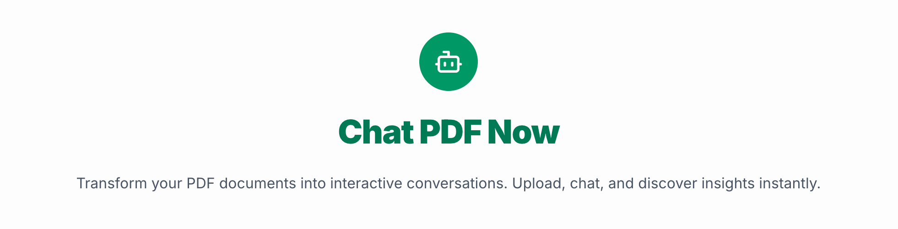

<p align="center">
  
</p>

## 📝 Overview

An AI-powered application that lets you ask questions to PDF documents.

## ✨ Features

- 🤖 **AI Driven** - Chat naturally with your documents
- 🔓 **Open-Source** - Free to use and modify
- 🆓 **Free to use** - Full-featured experience at no cost

## 🛠️ Tech Stack

- **Language**: [TypeScript](https://www.typescriptlang.org/)
- **Framework**: [Next.js](https://nextjs.org/)
- **Styling**: [Tailwind CSS](https://tailwindcss.com/)
- **UI Components**: [Shadcn UI](https://ui.shadcn.com/)
- **Backend & Database**: [Convex](https://www.convex.dev/)
- **Authentication**: [Clerk](https://clerk.com/)
- **AI Processing**: [OpenAI](https://openai.com/)
- **CI/CD & Hosting**: [Vercel](https://vercel.com/)

## 🚀 Getting Started

### Prerequisites

- Node.js 18+
- Clerk account for authentication
- Convex account for database and functions
- OpenAI account for AI processing

### Installation

1. Clone the repository and install dependencies

```bash
pnpm install
```

2. Copy the `.env.example` file to `.env.local`

```bash
cp .env.example .env.local
```

3. Set up your environment variables in the `.env.local` file

```env
# Convex Configuration
CONVEX_DEPLOYMENT=<your-convex-deployment>
NEXT_PUBLIC_CONVEX_URL=<your-convex-url>

# Clerk Authentication
NEXT_PUBLIC_CLERK_FRONTEND_API_URL=<your-clerk-frontend-api-url>
NEXT_PUBLIC_CLERK_PUBLISHABLE_KEY=<your-clerk-publishable-key>
CLERK_SECRET_KEY=<your-clerk-secret-key>
CLERK_WEBHOOK_SECRET=<your-clerk-webhook-secret>

# OpenAI Configuration
OPENAI_API_KEY=<your-openai-api-key>

```

4. Initialize Convex

```bash
npx convex dev
```

5. Set up environment variables in Convex dashboard:
   - `NEXT_PUBLIC_CLERK_FRONTEND_API_URL`
   - `CLERK_WEBHOOK_SECRET`
   - `OPENAI_API_KEY`

6. Set up webhook in Clerk dashboard:
   - `https://<your-convex-deployment>.convex.cloud/clerk-users-webhook`

### Development

```bash
# Run the development server (frontend)
pnpm dev

# Run the development server with Convex (backend)
pnpm dev:convex
```

### Building for Production

```bash
pnpm build
```

## 🤝 Contributing

We welcome contributions! Please:

1. Fork the repository
2. Create your feature branch (`git checkout -b feature/amazing-feature`)
3. Commit your changes (`git commit -m 'Add amazing feature'`)
4. Push to the branch (`git push origin feature/amazing-feature`)
5. Open a Pull Request

## ⚖️ License

This project is licensed under the MIT License. See the [LICENSE](LICENSE) file for details.
